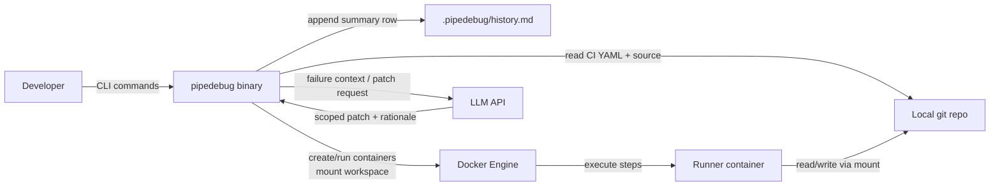
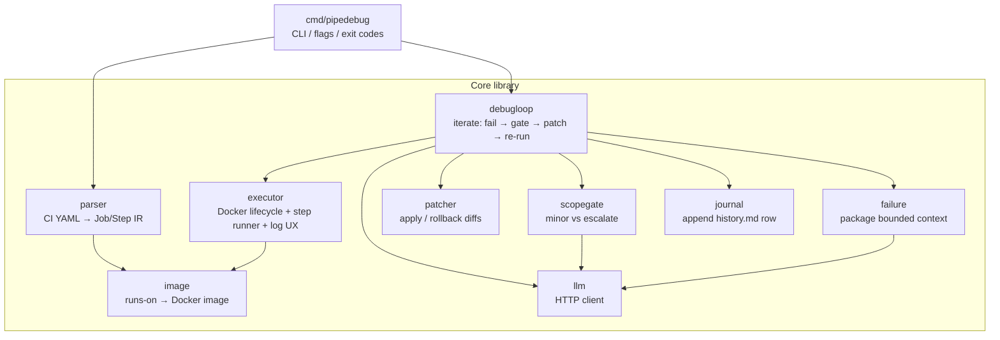

# Technical Design Doc: PipeDebug

**Status:** Draft (section-by-section)  
**Related:** [PRD](PRD.md) · [User Stories](USER_STORIES.md)

---

## 1. Overview

### Purpose

PipeDebug (`pipedebug`) is a CLI-first tool that executes CI/CD jobs locally inside Docker containers that mirror remote runner environments (GitHub Actions first; GitLab CI and CircleCI later). On failure, an optional LLM auto-debug loop packages the failure context, proposes scoped patches for minor code/CI errors, applies them within an allowlist, and re-runs the job until it passes or the failure is escalated to the user.

This document describes how the system will be built: components, data, APIs, tests, and operational constraints. Product intent and user-facing requirements live in the PRD; this TDD is the engineering contract for implementation.

### Scope

**In scope (MVP / P0)**
- CLI entrypoint (`pipedebug run`, flags for job selection, `--no-ai`, `--max-iterations`)
- GitHub Actions workflow parsing sufficient to run jobs/`run` steps locally
- Docker-based executor with repo mount, env/secrets injection, streamed logs
- Failure packaging → LLM scoped patch → apply → re-run loop
- Scope gate so architectural / ambiguous failures escalate instead of auto-editing
- No automatic git commits

**In scope (later / P1–P2)**
- Step-through mode, `pipedebug doctor`, image override
- Patch preview/rollback
- GitLab CI / CircleCI parsers
- Optional `--keep-logs` (retain last N full log files with rotation)

**Out of scope (for this project)**
- Replacing hosted CI as the merge/deploy source of truth
- Full emulation of every marketplace action, OIDC, or proprietary runner feature
- LLM-driven architecture or product redesigns
- Interactive web dashboard / hosted multi-tenant UI (see §2 — demo via CLI + README instead)
- Persisting full step logs by default

### Key requirements from PRD

| ID | Requirement | Design implication |
|----|-------------|--------------------|
| G1 / FR-PAR-* | Local environment parity via Docker | Image resolver + executor are core; parity gaps must fail loudly |
| G2 / FR-CLI-3–4 | Clear step logs and exit codes | Structured step runner with streamed stdout/stderr |
| G3 / FR-CLI-5 | Optional step-through | Executor must support pause/resume in one container session |
| G4 / FR-LLM-* | Auto-debug minor failures and re-run | Loop controller + failure packager + patch applier + LLM client |
| G5 | Human owns architecture | Classifier/scope gate before any write; escalate path required |
| FR-LLM-10 | Never auto-commit | Patch applier edits working tree only |
| FR-CLI-7 / FR-PAR-6 | Image override + secrets | Config layer for env files/flags; never persist secrets into repo |
| FR-UI-* (P2) | Dashboard (PRD later) | **Deferred:** no web UI in this build; history via append-only run journal + strong CLI/README demo |

### Design decisions (locked)

| Decision | Choice | Rationale |
|----------|--------|-----------|
| Language | Go | Strong CLI + Docker ecosystem fit; single static binary is easy to install and demo |
| UI | No dashboard | Core product is terminal feedback; a SPA would dilute scope. Hiring managers rarely run full local stacks—README + short demo recording + clean CLI matters more |
| Persistence | Append-only run journal (Markdown table) | One summary row per run; no full logs by default → tiny disk footprint, human-readable, `git`-friendly to ignore |
| Log UX | Live progress in terminal; full step output buffered (not dumped); on failure show **tail** of failing step; optional `--verbose` / `--keep-logs` | Avoid flooding the terminal or disk; still enough context for humans + LLM |

---

## 2. Tech Stack

### Frontend

**None for MVP.** The product surface is the CLI.

Demo / hiring visibility (without a dashboard):
- High-quality README with install, quickstart, and a short screen recording or GIF of `pipedebug run` + AI loop
- Terminal UX as the “UI” (clear step boundaries, patch summaries, escalation messages)
- Run journal (below) as a lightweight artifact reviewers can open in the repo after a demo

A full dashboard is only useful later if users need to browse many historical runs or compare local vs remote CI at scale. That is not the hiring-critical path for this tool.

### Backend

**Go CLI application** (single module, library packages + `cmd/pipedebug`).

| Layer | Role |
|-------|------|
| `cmd/pipedebug` | Cobra (or stdlib `flag`) CLI: `run`, later `doctor` |
| Config / CI parsers | YAML → normalized job/step model (GitHub Actions first) |
| Executor | Docker Engine API or `docker` CLI wrapper: create container, mount repo, run steps; capture step logs with controlled terminal output (see Log UX) |
| Auto-debug loop | Failure packager, scope gate, patch apply/rollback, re-run orchestration |
| LLM client | HTTP client to a chat/completions API (provider configurable via env) |
| Journal | Append one summary row per completed run |

Pipeline execution always happens **inside Docker**; the Go process is the orchestrator on the host.

### Database

**No database.** Persistence is file-based:

| Artifact | Location (default) | Contents |
|----------|--------------------|----------|
| Run journal | `.pipedebug/history.md` in the target repo (gitignored) | Markdown table; **one new row appended per run** |
| Optional logs | `.pipedebug/logs/` (only with `--keep-logs`, P1) | Full step logs; retain last N runs, delete older |
| In-memory / temp buffer | Per-step during a run | Used for failure packaging to the LLM and for printing a failure tail; discarded when the run ends unless `--keep-logs` |

**Default terminal output (not a raw dump of every line):**
- Step start/end lines and pass/fail status as the job runs (live progress)
- Successful steps: summary only (no full stdout), unless `--verbose`
- Failed step: print the **last N lines** (e.g. 50–100) of that step’s output, plus exit code
- AI loop: short rationale + diff summary, not a second copy of the full log

**Journal row fields (relevant, minimal):**

| Column | Purpose |
|--------|---------|
| `timestamp` | When the run finished (UTC ISO-8601) |
| `workflow` / `job` | What was executed |
| `status` | `passed` / `failed` / `escalated` / `max_iterations` |
| `failed_step` | Step name where it last failed (empty if passed) |
| `iterations` | Auto-debug attempts used |
| `files_changed` | Short list or count of patched paths (e.g. `ci.yml,Makefile` or `2`) |
| `duration` | Wall time (e.g. `47s`) |
| `ai` | `on` / `off` |

No full log bodies in the journal. Example row:

```md
| 2026-07-30T21:04:12Z | ci.yml / build | passed | | 2 | package.json | 47s | on |
```

### Infrastructure

| Piece | Choice |
|-------|--------|
| Runtime host | Developer laptop/CI agent with Docker available |
| Job isolation | Docker containers (runner images mapped from `runs-on` / overrides) |
| Distribution | Go binary via `go install` or GitHub Releases |
| Hosted cloud app | None required |

### Third-party services

| Service | Use |
|---------|-----|
| Docker Engine | Local container runtime for parity execution |
| LLM API (e.g. OpenAI-compatible) | Scoped fix proposals; API key via env (`PIPEDEBUG_LLM_API_KEY` or provider-specific) |
| (Optional later) GitHub/GitLab API | Fetch remote run results for parity comparison—not MVP |

---

## 3. Architecture

PipeDebug is a **single Go binary** on the developer machine. It orchestrates Docker (where CI steps actually run) and optionally an LLM API (for scoped auto-fixes). There is no hosted backend or multi-service mesh.

### High-level design

```
┌─────────────┐     parse      ┌──────────────────┐
│ CI YAML     │ ─────────────► │ Job / Step model │
└─────────────┘                └────────┬─────────┘
                                        │
                                        ▼
┌─────────────┐   mount repo   ┌──────────────────┐
│ Docker      │ ◄─────────────│ Runner executor  │
│ (parity)    │   run steps    └────────┬─────────┘
└─────────────┘                         │
                         pass ──────────┤──► journal row → done
                                   fail │
                                        ▼
                               ┌──────────────────┐
                               │ Failure artifact │
                               └────────┬─────────┘
                                        ▼
                               ┌──────────────────┐
                               │ LLM agent        │
                               │ (scope gate +    │
                               │  patch propose)  │
                               └────────┬─────────┘
                          escalate ─────┤──► journal row → stop
                                        │ apply patch
                                        ▼
                               re-enter executor (loop)
```

Same flow as the PRD, with journal write on terminal outcomes (pass, escalate, max iterations).

### System context diagram

What exists outside the binary, and how the user interacts with it:



**Trust / data notes**
- Secrets and env files stay on the host; injected into the container for the run; never written into the journal
- Failure tails + relevant file snippets are sent to the LLM when AI is enabled; full repo is not uploaded by default
- The container sees the mounted working tree (same files the developer is editing)

### Component diagram

Internal packages inside the Go module (logical components, one process):



**Happy-path control flow (AI on)**

1. CLI resolves repo path, flags (`--job`, `--max-iterations`, `--no-ai`, `--verbose`)
2. `parser` loads workflow → job/step IR; `image` resolves runner image
3. `executor` runs steps in Docker; buffers per-step logs; prints progress / failure tail
4. On success → `journal` append → exit 0
5. On failure + AI enabled → `failure` packages context → `scopegate` (+ LLM) classifies
6. If minor → `llm` proposes patch → `patcher` applies → back to step 3
7. If escalate / max iterations → `journal` append → non-zero exit (no auto-commit)

### Service boundaries

Not separate deployable services—**package boundaries** with clear ownership. Crossing them the wrong way is what creates spaghetti later.

| Boundary | Owns | Must not own |
|----------|------|--------------|
| `cmd/pipedebug` | Flags, UX copy, process exit codes | Docker details, YAML schema, LLM prompts |
| `parser` | Provider YAML → normalized **Job/Step IR** | Running containers, calling LLM |
| `image` | Mapping `runs-on` / overrides → image ref | Step execution |
| `executor` | Container create/mount/run/cleanup; log buffer + terminal Log UX | Patching files, LLM calls, journal format |
| `failure` | Bounded failure artifact (step, exit, log tail, snippets) | Deciding whether to fix |
| `scopegate` | Minor vs out-of-scope decision | Applying patches |
| `llm` | Provider HTTP, retries, response parse into a patch DTO | File I/O |
| `patcher` | Apply/rollback unified diffs within allowlist | Re-running CI |
| `debugloop` | Orchestration + iteration limits + stop reasons | Provider-specific YAML parsing |
| `journal` | Append one history row | Storing full logs |

**External boundaries**
| External | Interface | Failure mode |
|----------|-----------|--------------|
| Docker Engine | API or CLI wrapper behind `executor` | Clear error if daemon down / image pull fails (`doctor` later) |
| LLM API | HTTPS JSON behind `llm` | On error: stop loop, keep last good tree, tell user |
| Repo filesystem | Read CI + source; write only via `patcher` | Refuse writes outside allowlist |

**IR (anti-corruption layer)**  
Parsers convert GitHub Actions (later GitLab/CircleCI) into one internal model. `executor` and `debugloop` only speak IR—so new CI providers are new parsers, not forks of the run loop.

---

## 4. Data Design

No relational database. Almost all state is **ephemeral in-process** for a single `pipedebug run`. The only durable artifact is the append-only run journal (plus optional `--keep-logs` files later).

### Entities

In-memory / on-disk concepts the Go code cares about:

| Entity | Lifetime | Description |
|--------|----------|-------------|
| **Job** | Per run | Normalized IR: name, image, env, ordered steps |
| **Step** | Per run | Name, command(s), working directory, env overlays |
| **RunResult** | Per attempt | Pass/fail, failed step id, duration, iteration index |
| **FailureArtifact** | Per failed attempt | Exit code, log tail, relevant file/YAML snippets (bounded) |
| **PatchProposal** | Per AI iteration | Unified diff, rationale, target paths, scope decision |
| **JournalEntry** | Durable | One summary row appended when a top-level run finishes |

Source of truth for product code remains the **user working tree**; PipeDebug does not maintain a parallel code datastore.

### Database schema

**N/A — no database.**

**Persisted file:** `.pipedebug/history.md` (gitignored)

| Column | Type (logical) | Notes |
|--------|----------------|-------|
| `timestamp` | string (UTC ISO-8601) | Run end time |
| `workflow` | string | Workflow file or id |
| `job` | string | Job name |
| `status` | enum | `passed` \| `failed` \| `escalated` \| `max_iterations` |
| `failed_step` | string | Empty if passed |
| `iterations` | int | Auto-debug attempts used |
| `files_changed` | string | Short list or count of patched paths |
| `duration` | string | Wall time, e.g. `47s` |
| `ai` | enum | `on` \| `off` |

Header + one Markdown table row appended per completed CLI invocation. No full logs in this file.

Optional later (P1): `.pipedebug/logs/<run-id>.log` when `--keep-logs` is set; retain last N files only.

### Relationships

```
Job 1──* Step
Job 1──* RunResult          (one per executor attempt / loop iteration)
RunResult 0..1──1 FailureArtifact   (only on failure)
FailureArtifact 0..1──1 PatchProposal (only if AI proposes a fix)
CLI run 1──1 JournalEntry   (written once at the end)
PatchProposal *──▸ file paths in working tree (applied/rolled back; not stored as blobs)
```

---


## 5. API Design

*TBD*

### Endpoints

### Request/response formats

### Authentication

---

## 6. Component Design

*TBD*

### Class diagrams (UML)

### Module diagrams

---

## 7. Unit Tests

*TBD*

### Normal case

### Boundary / corner cases

### Exception cases

---

## 8. Non-Functional Requirements

*TBD*

### Performance

### Scalability

### Security

### Reliability

---

## 9. Deployment Architecture

*TBD*

### Environments

### CI/CD

### Cloud resources

---

## 10. Risks & Tradeoffs

*TBD*

### Alternative approaches considered

### Known limitations
