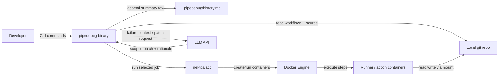
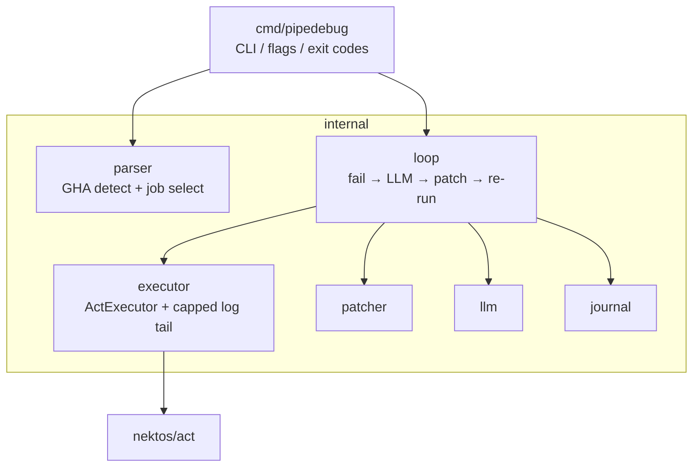
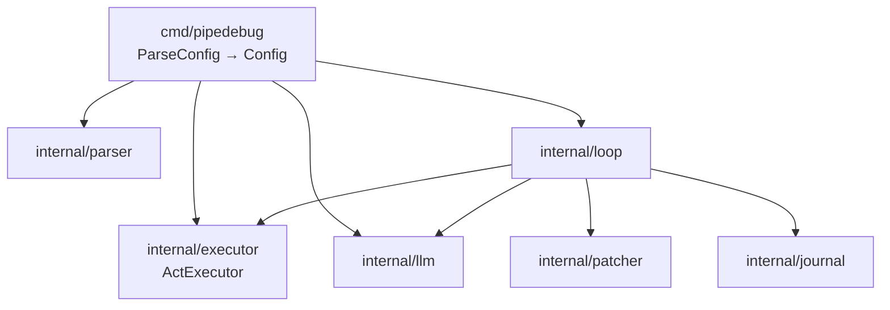
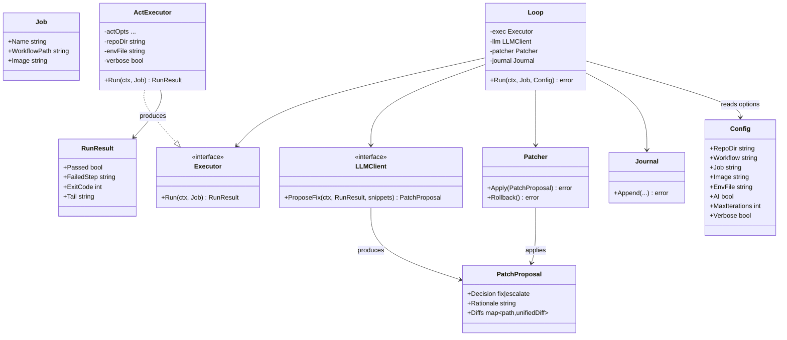

# Technical Design Doc: PipeDebug

**Status:** Draft (section-by-section)  
**Related:** [PRD](PRD.md) · [User Stories](USER_STORIES.md)

---

## 1. Overview

### Purpose

PipeDebug (`pipedebug`) is a CLI-first tool that runs **GitHub Actions** jobs locally (via [nektos/act](https://github.com/nektos/act) + Docker) and, on failure, runs an optional LLM auto-debug loop: package failure context → scoped patch for minor code/CI errors → apply within an allowlist → re-run until pass or escalate.

This document describes how the system will be built: components, data, APIs, tests, and operational constraints. Product intent and user-facing requirements live in the PRD; this TDD is the engineering contract for implementation.

### Scope

**In scope (MVP / P0)**
- CLI entrypoint (`pipedebug run`, flags for job selection, `--no-ai`, `--max-iterations`)
- GitHub Actions only: detect `.github/workflows`, select workflow/job
- **`ActExecutor`**: run the selected job through **nektos/act** (parity for `run:`, `uses:`, `if`, etc. comes from act—not a custom step runner)
- Stream/capture logs into a capped tail for humans + LLM; env/secrets via act/`--env-file`
- Failure packaging → LLM scoped patch → apply → re-run loop
- Scope gate so architectural / ambiguous failures escalate instead of auto-editing
- No automatic git commits

**In scope (later / P1–P2)**
- Step-through mode (if act integration allows cleanly; otherwise defer), `pipedebug doctor`
- Image/platform override flags passed through to act
- Patch preview/rollback

**Out of scope (for this project)**
- GitLab CI / CircleCI support (not committed; architecture stays expandable—see below)
- Replacing hosted CI as the merge/deploy source of truth
- Reimplementing a GitHub Actions runner (act owns execution parity)
- LLM-driven architecture or product redesigns
- Interactive web dashboard / hosted multi-tenant UI (see §2 — demo via CLI + README instead)
- Persisting full step logs (stream is capped to a tail buffer; no log archive in MVP)

**Expandability (deliberate non-goal to implement now)**  
Keep `Executor` + a small `Job` IR so a future GitLab (or other) backend could plug in without rewriting the AI loop. Do **not** build GitLab parsers/executors or advertise multi-provider support until shipped. Resume narrative: focused GHA + AI loop; clean seam if asked “how would you add GitLab?”

### Key requirements from PRD

| ID | Requirement | Design implication |
|----|-------------|--------------------|
| G1 / FR-PAR-* | Local environment parity via Docker + act | `ActExecutor` wraps act; document act’s remaining parity gaps |
| G2 / FR-CLI-3–4 | Clear step logs and exit codes | Parse/stream act output into step boundaries + capped tail + exit mapping |
| G3 / FR-CLI-5 | Optional step-through | P1 only if feasible on top of act; otherwise defer |
| G4 / FR-LLM-* | Auto-debug minor failures and re-run | Loop controller + failure packager + patch applier + LLM client |
| G5 | Human owns architecture | Classifier/scope gate before any write; escalate path required |
| FR-LLM-10 | Never auto-commit | Patch applier edits working tree only |
| FR-CLI-7 / FR-PAR-6 | Image override + secrets | Pass through to act; never persist secrets into repo |
| FR-UI-* (P2) | Dashboard (PRD later) | **Deferred:** no web UI in this build; history via append-only run journal + strong CLI/README demo |

### Design decisions (locked)

| Decision | Choice | Rationale |
|----------|--------|-----------|
| Language | Go | Strong CLI + Docker ecosystem fit; single static binary is easy to install and demo |
| CI provider (shipped) | **GitHub Actions only** | Resume focus; one strong demo path. Multi-provider is an extension seam, not a commitment |
| Job execution | **nektos/act** behind `Executor` | act already handles Actions semantics (`uses`, `if`, contexts, images). Our value is the AI debug loop, not a runner clone |
| UI | No dashboard | Core product is terminal feedback; a SPA would dilute scope. Hiring managers rarely run full local stacks—README + short demo recording + clean CLI matters more |
| Persistence | Append-only run journal (Markdown table) | One summary row per run; no full logs by default → tiny disk footprint, human-readable, `git`-friendly to ignore |
| Log UX | Live progress in terminal; keep only a **capped tail** of each step (drop older lines); on failure show that tail; optional `--verbose` | Avoid flooding terminal/RAM; enough context for humans + LLM without dual spool systems |

---

## 2. Tech Stack

### Frontend

**None for MVP.** The product surface is the CLI.

Demo / hiring visibility (without a dashboard):
- High-quality README with install, quickstart, and a short screen recording or GIF of `pipedebug run` + AI loop
- Terminal UX as the “UI” (clear step boundaries, patch summaries, escalation messages)
- Run journal (below) as a lightweight artifact reviewers can open in the repo after a demo

A full dashboard is only useful later if users need to browse many historical runs or compare local vs remote CI at scale. That is not the hiring-critical path for this tool.

### Backend

**Go CLI application** (single module, library packages + `cmd/pipedebug`).

| Layer | Role |
|-------|------|
| `cmd/pipedebug` | Parse argv → typed `Config`; subcommands `run` (P1: `doctor`); wire deps; exit codes |
| Workflow select / validate | Detect GHA workflows; resolve workflow + job; optional [actionlint](https://github.com/rhysd/actionlint) for clear pre-run errors |
| `ActExecutor` | Concrete `Executor`: invoke **nektos/act** for the selected job; stream logs; capped tail → `RunResult` |
| `loop` | fail → LLM propose → patch → re-run |
| LLM client | HTTP chat/completions → `PatchProposal` |
| Journal | Append one summary row per completed run |

**act** drives containers via Docker; PipeDebug orchestrates act + the AI loop on the host. Prefer calling act as a library (`github.com/nektos/act/...`) when practical; shelling out to the `act` CLI is acceptable for MVP if library integration is sticky—still behind `Executor`.

### Database

**No database.** Persistence is file-based:

| Artifact | Location (default) | Contents |
|----------|--------------------|----------|
| Run journal | `.pipedebug/history.md` in the target repo (gitignored) | Markdown table; **one new row appended per run** |
| Step tail buffer | In-process, per step | Ring/capped buffer of last N lines or ~256KB; discarded when the run ends |

**Default terminal output (not a raw dump of every line):**
- Step start/end lines and pass/fail status as the job runs (live progress)
- Successful steps: summary only (no full stdout), unless `--verbose`
- Failed step: print the capped tail already held in memory, plus exit code
- AI loop: short rationale + diff summary, not a second copy of the log

**Journal row fields (relevant, minimal):**

| Column | Purpose |
|--------|---------|
| `timestamp` | When the run finished (UTC ISO-8601) |
| `workflow` / `job` | What was executed |
| `status` | `passed` / `failed` / `escalated` / `max_iterations` |
| `failed_step` | Step name where it last failed (empty if passed) |
| `iterations` | Auto-debug attempts used |
| `files_changed` | Short list or count of patched paths (e.g. `ci.yml,Makefile` or `2`) |
| `duration` | Wall time (e.g. `47s`) |
| `ai` | `on` / `off` |

No full log bodies in the journal. Example row:

```md
| 2026-07-30T21:04:12Z | ci.yml / build | passed | | 2 | package.json | 47s | on |
```

### Infrastructure

| Piece | Choice |
|-------|--------|
| Runtime host | Developer laptop/CI agent with Docker available |
| Job isolation | Docker containers via nektos/act (Actions runner images / overrides) |
| Distribution | Go binary via `go install` or GitHub Releases |
| Hosted cloud app | None required |

### Third-party services

| Service | Use |
|---------|-----|
| Docker Engine | Local container runtime for parity execution |
| LLM API (e.g. OpenAI-compatible) | Scoped fix proposals; API key via env (`PIPEDEBUG_LLM_API_KEY` or provider-specific) |
| (Optional later) GitHub/GitLab API | Fetch remote run results for parity comparison—not MVP |

---

## 3. Architecture

PipeDebug is a **single Go binary** on the developer machine. It orchestrates **nektos/act** (which uses Docker for the Actions job) and optionally an LLM API (for scoped auto-fixes). There is no hosted backend or multi-service mesh.

### High-level design

```
┌─────────────┐   select/validate   ┌──────────────────┐
│ GHA YAML    │ ──────────────────► │ Job (workflow +  │
│ workflows   │                     │ job id, opts)    │
└─────────────┘                     └────────┬─────────┘
                                             │
                                             ▼
┌─────────────┐   act runs job      ┌──────────────────┐
│ Docker      │ ◄──────────────────│ ActExecutor      │
│ (via act)   │   stream logs       └────────┬─────────┘
└─────────────┘                              │
                              pass ──────────┤──► journal row → done
                                        fail │
                                             ▼
                                    ┌──────────────────┐
                                    │ Failure artifact │
                                    └────────┬─────────┘
                                             ▼
                                    ┌──────────────────┐
                                    │ LLM agent        │
                                    │ (scope gate +    │
                                    │  patch propose)  │
                                    └────────┬─────────┘
                               escalate ─────┤──► journal row → stop
                                             │ apply patch
                                             ▼
                                    re-enter executor (loop)
```

Same flow as the PRD, with journal write on terminal outcomes (pass, escalate, max iterations).

### System context diagram

What exists outside the binary, and how the user interacts with it:



**Trust / data notes**
- Secrets and env files stay on the host; injected for the act run; never written into the journal
- Failure tails + relevant file snippets are sent to the LLM when AI is enabled; full repo is not uploaded by default
- Containers see the mounted working tree (same files the developer is editing)

### Component diagram

Internal packages inside the Go module (logical components, one process):



**Happy-path control flow (AI on)**

1. CLI resolves repo path and flags
2. `parser` finds GitHub Actions workflows, selects workflow + job → `Job` (optional actionlint validation; apply `--image` / platform overrides into act options)
3. `ActExecutor` runs the job via act; streams output; keeps capped log tail; maps outcome → `RunResult`
4. On success → `journal` append → exit 0
5. On failure + AI enabled → `llm` gets tail + snippets → `fix` or `escalate`
6. If fix → `patcher` applies → back to step 3
7. If escalate / max iterations → `journal` append → non-zero exit (no auto-commit)

### GitHub Actions + act strategy

**Shipped product = GitHub Actions only.** Do not hand-roll an Actions runner or a multi-provider YAML platform.

```
detect(.github/workflows) → select workflow + job → types.Job
ActExecutor.Run(ctx, job) → invoke act → RunResult (capped tail)
```

| Concern | Owner |
|---------|--------|
| Actions semantics (`run`, `uses`, `if`, `id`, expressions, action containers) | **nektos/act** |
| Workflow/job selection, flags, clear “no workflow” errors | **our parser / CLI** |
| Optional preflight lint | **actionlint** (library) — nice errors before burning a Docker pull |
| Capped log tail, `RunResult`, AI loop, patch apply | **PipeDebug** |
| Image / platform override | Pass through to act (e.g. `-P` / equivalent); do not reimplement `runs-on` maps unless act needs help |

**`Job` IR (execution-oriented)**  
For act, `Job` is primarily an **invocation handle**: workflow path, job id, repo dir, env/image overrides—not a full re-hosting of every step. Optional light metadata (step names from YAML or act output) helps UX/LLM labeling. We do **not** need to re-encode every Actions field into our structs for the job to run correctly.

**Future providers (not in scope)**  
`Executor` stays an interface. A later `GitLabExecutor` (or similar) could implement `Run` without changing `loop` / `llm` / `patcher`. Detection can grow a provider enum later. Until then: if the repo has no GHA workflows, fail with a clear message (do not stub GitLab).

### Service boundaries

Package boundaries (one process—not microservices):

| Boundary | Owns | Must not own |
|----------|------|--------------|
| `cmd/pipedebug` | Flags, UX copy, exit codes, wiring | act/Docker/LLM details |
| `parser` | Detect GHA; select workflow/job; optional actionlint; build `Job` + act options | Running containers; reimplementing Actions execution |
| `executor` (`ActExecutor`) | Invoke act; stream/capture logs; capped tail → `RunResult` | Patching, LLM, journal format |
| `llm` | HTTP + parse `PatchProposal` | File I/O |
| `patcher` | Allowlisted apply/rollback | Re-running CI |
| `loop` | Iterations + stop reasons | act CLI flags / Actions YAML grammar |
| `journal` | One history row | Full logs |

**External boundaries**
| External | Interface | Failure mode |
|----------|-----------|--------------|
| nektos/act | Behind `Executor` (`ActExecutor`) | Clear error if act missing/fails; map non-zero job → failed `RunResult` |
| Docker Engine | Used by act | Exit `3` if daemon down / pull fails (surface act/Docker errors) |
| LLM API | Behind `LLMClient` interface | Stop loop, keep tree, tell user |
| Repo filesystem | Writes only via `patcher` | Refuse paths outside allowlist |

**IR:** `loop` speaks `Job` + `RunResult` only. Swapping act for another backend later = new `Executor` impl, not a forked AI loop.

---

## 4. Data Design

No relational database. Almost all state is **ephemeral in-process** for a single `pipedebug run`. The only durable artifact is the append-only run journal.

### Intermediate log storage (for the LLM)

When a step fails, the LLM needs failure context — so logs are **captured during the run**, not only printed. Real CI logs can be huge, so we **only keep a capped tail**.

| Layer | What | Lifetime |
|-------|------|----------|
| **Capped log tail** | In-memory ring inside `executor`: last ~100–200 lines or ~256KB | Dropped when the step/run ends |
| **RunResult** | Pass/fail, failed step, exit code, that tail | Per executor attempt |
| **Journal** | One summary row | Durable; **no** log body |

No temp log files in MVP. Snippets for the LLM are read ad hoc from the workspace when building the `ProposeFix` call—not a separate persisted entity.

### Entities

| Entity | Lifetime | Description |
|--------|----------|-------------|
| **Job** | Per run | Workflow path, job name, optional image/platform override (act invocation handle) |
| **RunResult** | Per attempt | Pass/fail, failed step (from act output when available), exit code, capped log tail |
| **PatchProposal** | Per AI iteration | `fix` \| `escalate`, rationale, path→diff map |
| **JournalEntry** | Durable | One summary row when the CLI run finishes |

Source of truth for product code remains the **user working tree**; PipeDebug does not maintain a parallel code datastore.

### Database schema

**N/A — no database.**

**Persisted file:** `.pipedebug/history.md` (gitignored)

| Column | Type (logical) | Notes |
|--------|----------------|-------|
| `timestamp` | string (UTC ISO-8601) | Run end time |
| `workflow` | string | Workflow file or id |
| `job` | string | Job name |
| `status` | enum | `passed` \| `failed` \| `escalated` \| `max_iterations` |
| `failed_step` | string | Empty if passed |
| `iterations` | int | Auto-debug attempts used |
| `files_changed` | string | Short list or count of patched paths |
| `duration` | string | Wall time, e.g. `47s` |
| `ai` | enum | `on` \| `off` |

Header + one Markdown table row appended per completed CLI invocation. No full logs in this file.

### Relationships

```
Job 1──* RunResult            (one per executor attempt / loop iteration)
RunResult 0..1──1 PatchProposal   (on failure + AI; escalate has empty diffs)
CLI run 1──1 JournalEntry     (once at end; no log body)
PatchProposal *──▸ working tree files (applied/rolled back; not stored as blobs)
```

---


## 5. API Design

PipeDebug does **not** expose a hosted REST/HTTP API in MVP. The user-facing interface is the **CLI**. Externally, the binary is a **client** of Docker and an LLM HTTP API. Internally, packages talk through small Go interfaces (test seams).

### Endpoints

#### User-facing: CLI

| Command | Purpose |
|---------|---------|
| `pipedebug run` | Parse CI config, run job in Docker, optional AI loop, append journal row |
| `pipedebug doctor` | P1 — check Docker, image pull, config parse |

**`pipedebug run` flags (MVP)**

| Flag | Default | Meaning |
|------|---------|---------|
| `--workflow` | auto-detect | Workflow file path |
| `--job` | required if ambiguous | Job name to run |
| `--no-ai` / `--fix` | AI on | Skip LLM auto-debug |
| `--max-iterations` | `3` | Cap AI fix attempts |
| `--verbose` | off | Stream full step output to terminal |
| `--image` | act default platform map | Override runner image / platform passed through to act |
| `--env-file` | none | Inject secrets/env into container |
| `--yes` | off | P1 — auto-apply patches without diff confirmation |

**Exit codes**

| Code | Meaning |
|------|---------|
| `0` | Job passed (with or without AI fixes) |
| `1` | Job failed / escalated / max iterations |
| `2` | Usage / config error (bad flags, unparseable YAML) |
| `3` | Environment error (Docker unavailable, image pull failed, missing LLM key when AI on) |

#### External: LLM (outbound HTTP)

OpenAI-compatible Chat Completions (provider swappable via base URL + model env).

| Method | Path | Role |
|--------|------|------|
| `POST` | `{base}/v1/chat/completions` | Scope classification + patch proposal |

One logical “fix” request per failed iteration (classification can be the same call that returns a patch or `escalate`).

#### External: act + Docker (outbound local)

Not REST in our public API sense — `ActExecutor` invokes **nektos/act**, which talks to the local Docker Engine:

- act plans/runs the selected GitHub Actions job (including `uses:` / `run:` / conditionals as act supports)
- Docker creates containers, mounts workspace, streams logs; we capture a capped tail into `RunResult`

#### Not in MVP

- No `localhost` HTTP server for the CLI
- No dashboard REST API
- No webhook receivers

### Request/response formats

#### CLI → user (stdout/stderr)

Structured for humans, stable enough to grep:

```text
→ step "Install deps"
✗ step "Install deps" failed (exit 1)
--- log tail ---
...
--- end ---
🤖 minor fix: typo in package name (package.json)
applied 1 file; re-running (iteration 2/3)
✓ job build passed after 2 iteration(s)
```

Machine-oriented detail stays in `.pipedebug/history.md` (one row), not a JSON API.

#### LLM request (conceptual)

JSON body to chat completions including:

- System: scope rules (minor vs escalate; no architecture changes; return patch or escalate)
- User: failed step, exit code, capped log tail, relevant file/YAML snippets

**Expected LLM response (parsed into `PatchProposal`)**

```json
{
  "decision": "fix" | "escalate",
  "rationale": "string",
  "files": [
    { "path": "relative/path", "unified_diff": "..." }
  ]
}
```

If `decision` is `escalate`, `files` is empty and the loop stops. Invalid JSON / paths outside allowlist → skip apply / rollback.

#### Internal Go interfaces (test seams only)

Mock the two external I/O edges; keep patcher/journal concrete:

```go
type Executor interface {
    Run(ctx context.Context, job Job) (RunResult, error)
}

type LLMClient interface {
    ProposeFix(ctx context.Context, result RunResult, snippets map[string]string) (PatchProposal, error)
}
```

### Authentication

| Surface | Auth |
|---------|------|
| CLI | None (local process; user already has filesystem access) |
| Docker Engine (via act) | Local daemon access (default socket / Docker context); no PipeDebug-managed credentials |
| LLM API | API key via env, e.g. `PIPEDEBUG_LLM_API_KEY` (or provider-specific); optional `PIPEDEBUG_LLM_BASE_URL`, `PIPEDEBUG_LLM_MODEL` |
| Secrets for CI steps | User-supplied `--env-file` / flags; injected into container only; never sent to the LLM or written to the journal |

If AI is enabled and the LLM key is missing → exit `3` with a clear message. `--no-ai` does not require a key.

---


## 6. Component Design

Keep the surface small: **interfaces only where we mock I/O** (`Executor`, `LLMClient`). Concrete Docker runner and CLI config are first-class—without an enterprise “arg parser framework” package.

### CLI parameters → typed config

**Yes — parse once into a struct. No — don’t build a separate `ArgParser` package.**

| Approach | Verdict |
|----------|---------|
| Scatter `flag.String` / `os.Args` reads across packages | Bad — hard to test, flags leak into core |
| Dedicated `internal/argparser` with plugins/registry | Overengineered for this CLI |
| `cmd/pipedebug`: parse argv → `Config`, validate, pass down | **Preferred** |

**Library choice:** stdlib `flag` is enough for a single `run` command. Use **Cobra** when we add `doctor` (subcommand UX is its job). Either way, the output is the same: a `Config` value.

```go
// Built in cmd/pipedebug from flags + env; passed into loop — never re-parsed deeper.
type Config struct {
    RepoDir        string
    Workflow       string
    Job            string
    Image          string // optional override
    EnvFile        string
    AI             bool
    MaxIterations  int
    Verbose        bool
}
```

Flow: `main` → `ParseConfig(os.Args)` → validate (job required if ambiguous, AI implies API key present, etc.) → construct `ActExecutor` / `LLM` / `Patcher` / `Journal` → `loop.Run(ctx, job, cfg)`.

### Module diagrams

#### Repository layout

```
pipedebug/
├── cmd/pipedebug/
│   ├── main.go          # wire deps, map errors → exit codes
│   └── config.go        # ParseConfig / validation (CLI boundary)
├── docs/
│   ├── PRD.md
│   ├── USER_STORIES.md
│   └── TECHNICAL_DESIGN.md
├── internal/
│   ├── parser/          # GHA detect + workflow/job select (+ optional actionlint)
│   ├── executor/        # Executor interface + ActExecutor (nektos/act)
│   ├── llm/             # LLMClient interface + HTTP impl
│   ├── patcher/         # apply / rollback diffs
│   ├── journal/         # append history.md
│   └── loop/            # orchestration
└── go.mod
```

Shared types (`Job`, `RunResult`, `PatchProposal`) live next to owners or a tiny `internal/types` only if import cycles force it—no `domain` / `failure` / `scopegate` layers. `Step` is optional metadata for UX/LLM, not required for act to execute.

#### Module dependency diagram



### Class diagrams (UML)



`ActExecutor` owns invoking nektos/act for `Job` (workflow + job id + overrides), streaming output into a private capped tail, and returning `RunResult`. Tests inject a fake `Executor` instead of calling act.

**Still omitted (details, not architecture):** exact act library vs CLI wiring; private log-tail buffer; separate `FailureArtifact` type; interface wrappers for `Patcher` / `Journal`.

#### Key behaviors

| Component | Behavior |
|-----------|----------|
| `cmd` / `Config` | Parse + validate CLI/env once; wire concrete deps; set exit codes |
| `parser` | Detect GHA workflows; select workflow/job → `Job`; optional actionlint; map overrides for act |
| `ActExecutor` | Run job via act; capped tail; log UX; map pass/fail |
| `llm` | Tail + snippets → `fix` + diffs or `escalate` |
| `patcher` | Allowlisted apply / rollback |
| `loop` | Iterations + stop conditions; journal once at end |
| `journal` | Append one Markdown table row |

---

## 7. Non-Functional Requirements

NFRs for a **local CLI** (not a multi-tenant service). Targets are practical demo/dev-machine expectations.

### Performance

| Area | Requirement |
|------|-------------|
| Orchestrator overhead | Go process should add negligible latency vs the Docker job itself (parse + wire-up typically under 1s for normal workflows) |
| Log handling | Capped tail buffer (~100–200 lines / ~256KB) so long CI output cannot grow host memory unbounded |
| Terminal UX | Step progress lines appear as steps start/finish; failure tail prints promptly after the failing step exits |
| LLM calls | Bounded by `--max-iterations` (default 3); each call sends only tail + small snippets, not the full repo |
| Re-runs | After a patch, re-run the same job without redundant image pulls when the image is already local |
| Journal | Append one row; must stay O(1) work per run (no rewriting full history) |

Non-goals: beating hosted CI wall-clock for heavy builds; caching build artifacts beyond what Docker/layer caching already provides.

### Scalability

This product scales with **developer machines and repo size**, not request QPS.

| Dimension | Approach |
|-----------|----------|
| Concurrent users | One CLI process per invocation; no shared server |
| Job size | Supported as far as local Docker + disk allow; we only retain a log tail |
| AI iterations | Hard cap (`--max-iterations`) to bound time and API cost |
| History file | Append-only Markdown; acceptable to grow slowly—document that users may truncate/delete `.pipedebug/history.md` |
| Multi-job workflows | MVP runs one selected job; parallel matrix fan-out is out of scope |

### Security

| Area | Requirement |
|------|-------------|
| Secrets | From `--env-file` / flags only; inject into the container; **never** write to journal, README, or LLM prompts |
| LLM data | Send capped log tail + relevant snippets only; do not upload the whole workspace by default |
| Patches | Apply only under repo-relative allowlist; reject `..`, absolute paths, and escapes outside `Config.RepoDir` |
| Git | Never auto-commit or push; user reviews `git diff` |
| API keys | LLM key via env only; not logged; not echoed in verbose output |
| Docker trust | Runs with the privileges of the local Docker daemon/user—document that malicious CI YAML can execute as whatever the mounted workspace + container user allows (same class of risk as running CI locally) |
| Supply chain | Pin Go module versions; treat act args/paths carefully; prefer library integration over unsanitized shell strings where practical |

### Reliability

| Area | Requirement |
|------|-------------|
| Docker down / pull fail | Fail fast with exit code `3` and an actionable message (no partial silent success) |
| LLM errors / timeouts | Stop the auto-debug loop; leave workspace as last good apply (or rolled back if apply failed); surface the CI failure |
| Bad patch | Rollback last apply; count toward iteration limit; do not leave a half-applied diff |
| Crash mid-run | Best-effort container cleanup (`defer` remove); temp/orphan containers should not accumulate across normal failures |
| Unsupported YAML | Error clearly at parse time rather than inventing incorrect behavior |
| Idempotent journal | A completed run appends exactly one row (success, fail, escalate, or max iterations) |
| `--no-ai` | Pure local execution path with no network dependency on the LLM |

---

## 8. Deployment Architecture

**No hosted deployment.** PipeDebug is a local CLI: it runs on the developer’s machine (or any agent with Docker), not as a cloud service. There is no app server, load balancer, or multi-tenant environment to provision.

What “deploy” means here: **build and distribute a Go binary**, plus document host prerequisites.

### Environments

| Environment | Role |
|-------------|------|
| Developer laptop | Primary: `pipedebug run` against a local repo + Docker Desktop/Engine |
| Optional CI agent | Same binary can run in automation if Docker-in-Docker / sibling Docker is available—not required for MVP |
| Staging / prod SaaS | **N/A** |

**Host prerequisites**
- Docker Engine (daemon running)
- nektos/act available (bundled/library dependency preferred; document CLI fallback if used)
- Network access to pull runner/action images (first run) and to the LLM API when AI is enabled
- LLM API key in env when not using `--no-ai`

### CI/CD

CI/CD for **this repo** (building PipeDebug itself), not for deploying a backend:

| Piece | Approach |
|-------|----------|
| Build | `go build -o pipedebug ./cmd/pipedebug` |
| Test | `go test ./...` on PRs |
| Release (optional) | GitHub Releases with binaries via GoReleaser or `go install` from the module path |
| Install for users | `go install …/cmd/pipedebug@latest` or download release artifact |

PipeDebug does not deploy customer apps; it only helps debug *their* pipelines locally.

### Cloud resources

| Resource | Needed? |
|----------|---------|
| VMs / Kubernetes / serverless | No |
| Managed DB / object storage | No |
| Hosted PipeDebug API | No |
| Third-party (user-provided) | Docker Hub (or other registries) for images; LLM provider API |

---

## 9. Risks & Tradeoffs

### Alternative approaches considered

| Topic | Alternatives | Choice | Why |
|-------|--------------|--------|-----|
| Language | TypeScript, Python | **Go** | Single static binary, solid Docker/HTTP ecosystem, strong CLI signal |
| CI providers | Multi-provider MVP (GHA + GitLab + CircleCI) | **GitHub Actions only**; `Executor` seam for later | Resume focus; shipping one solid path beats thin multi-provider stubs |
| Job execution | Custom Docker step runner; wrap act | **Wrap nektos/act** behind `Executor` | act owns Actions parity (`uses`/`if`/…); our novel value is the AI fix loop |
| UI | Web dashboard, TUI | **CLI only** | Core loop is terminal feedback; a SPA dilutes scope without helping demos much |
| Persistence | SQLite / full log archive | **Markdown journal + in-memory log tail** | Tiny footprint; enough history without a DB |
| Log capture | Full temp spool + ring buffer | **Capped in-memory tail only** | Dual spool was overkill for MVP; failures show up in the tail |
| Patch isolation | Git worktree / scratch branch | **Edit working tree + no auto-commit** | Simpler mental model; user owns `git diff` / commit |
| LLM scope gate | Separate classifier service/package | **`fix` \| `escalate` in one LLM response** + allowlist in `patcher` | Fewer moving parts |
| CLI parsing | Custom `ArgParser` package / scattered `os.Args` | **`Config` parsed once in `cmd`** (`flag` → Cobra when subcommands land) | Standard Go CLI shape |
| Workflow validate | Hand-roll Actions grammar; skip lint | **Job select + optional actionlint**; execution via act | Don’t own the runner or the full grammar |
| Hosted product | SaaS runner / remote agents | **Local-only** | Matches the problem (parity on your machine); no cloud deploy surface |

### Risks & mitigations

| Risk | Impact | Mitigation |
|------|--------|------------|
| Incomplete parity with GitHub-hosted runners | Local green ≠ remote green (or the reverse) | Rely on act; document act/GHA gaps (OIDC, some services, etc.); optional image override |
| act API / CLI churn | Integration breaks | Pin act version; keep a thin `ActExecutor` adapter; tests with fake `Executor` for the loop |
| LLM changes architecture or over-edits | Bad diffs, lost trust | Prompt rules + `escalate` path + path allowlist + `--max-iterations` + no auto-commit |
| Secrets leak to LLM or journal | Security incident | Never put env-file values in prompts or history rows; only log tails + code snippets |
| Malicious/unsafe CI YAML locally | Arbitrary code as Docker user | Same class of risk as `act` / local CI; document clearly; don’t escalate privileges |
| Huge step logs | Memory pressure / useless LLM context | Capped tail buffer; send only that tail + small snippets |
| Docker/act missing or pull failures | Tool unusable | Exit `3` with actionable errors; P1 `doctor` checks Docker + act |
| LLM outage / bad JSON | Loop stuck or broken tree | Timeout; stop loop; rollback failed applies; `--no-ai` escape hatch |
| Patch apply leaves dirty tree | User frustration | Atomic-enough apply + rollback on failure / non-improvement |

### Known limitations

- **GitHub Actions only** — no GitLab/CircleCI in this project; architecture can accept another `Executor` later
- **Not a replacement for hosted CI** — merges/deploys still go through GitHub Actions
- **Parity bounded by act** — whatever act cannot emulate, we cannot either; document those gaps
- **One job per invocation** — no full workflow graph / parallel jobs in MVP
- **AI fixes are best-effort** — minor errors only; architectural and ambiguous failures escalate
- **No dashboard / remote run compare** in this build
- **No full log retention** — only capped tails unless a later opt-in is added
- **Requires Docker + act + (for AI) an LLM API key and network**
- **Patches modify the working tree** — concurrent edits by the user during a run can conflict (don’t run against a tree you’re actively rewriting)

### Open decisions (non-blocking for MVP)

1. act as Go library import vs shell out to `act` CLI for v1 speed
2. How much failed-step parsing to do from act logs vs “whole job failed + tail”
3. Whether step-through (P1) is feasible on top of act or deferred
4. Cloud LLM only vs. optional local model (Ollama) later
